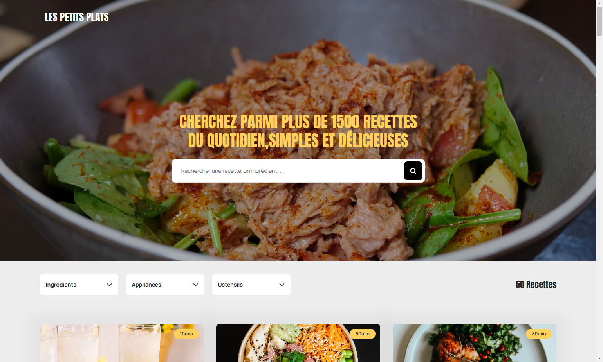

# Projet 7 : Les petits plats

Création de deux algorithmes de recherche pour obtenir la version la plus optimale.
> Projet n°7 : Les Petits Plats - Formation OpenClassrooms JS React.

## Documentation
* Résultat [Voir le benchmark des algorithmes](https://jsben.ch/HAhnM)
* Documentation [Voir le document d'investigation](Fiche_d'investigation.pdf)